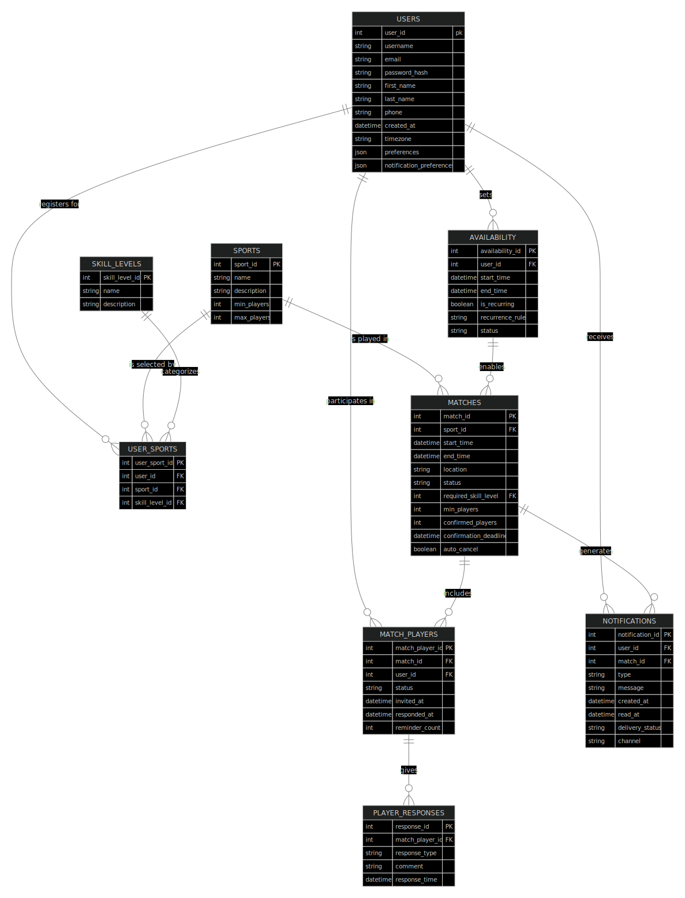

# Database Documentation

## Database Software

This project uses a [PostgreSQL](https://www.postgresql.org/) database.

### Dev Environment Setup

- [Linux (.deb based) Instructions](setup_instructions/linux_setup.md).
- [macOS Instructions](setup_instructions/macos_setup.md).
- [Windows Instructions](setup_instructions/windows_setup.md).

### Database Schema

The database schema creation sql: [schema.sql](sql/schema.sql).

### SQL Queries

Queries .sql files are listed under the [sql folder](sql).

## Entity Relationship Diagram (ERD)

### ERD Explanation

- Users and their data:
  - USERS store personal information and preferences.
  - Each user has a unique username.
  - Each user can have multiple USER_SPORTS (sports they play with skill levels).
  - Users set their AVAILABILITY (when they can play).
  - Users participate in matches via MATCH_PLAYERS records.
  - Users receive NOTIFICATIONS about match invites and updates.

- Sports and Skill Levels:
  - SPORTS contains all available sports with their requirements.
  - SKILL_LEVELS defines the proficiency levels (ForFun, Learning, Intermediate, etc.).
  - USER_SPORTS connects users to their sports and skill levels.

- Match Management:
  - MATCHES stores all game sessions with timing, location, and requirements.
  - MATCH_PLAYERS tracks who's invited and their response status.
  - PLAYER_RESPONSES records each acceptance/rejection with timestamps.
  - NOTIFICATIONS handles alerting users about matches.

- Time Management:
  - AVAILABILITY stores when users are free to play.
  - The recurrence_rule field enables patterns like "every Tuesday at 7pm".

NOTE: 
Open [ERD.md](erd/ERD.md) to view the ERD code. The diagram is created using Mermaid Markdown.

- Mermaid code can be viewed as a diagram online at [Mermaid Live](https://mermaid.live).
- Mermaid code can be viewed as a diagram in VSCode using the extension [Markdown Preview Mermaid Support](https://marketplace.visualstudio.com/items?itemName=bierner.markdown-mermaid).

