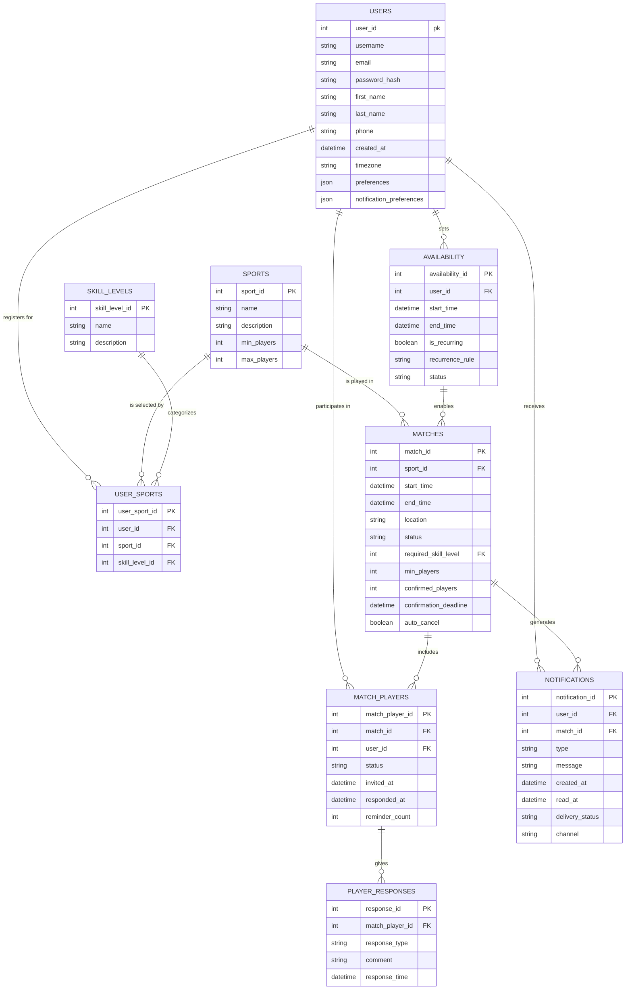

# Entity Relationship Diagram (ERD)

```mermaid

erDiagram
  USERS {
    int user_id pk
    string username
    string email
    string password_hash
    string first_name
    string last_name
    string phone
    datetime created_at
    string timezone
    json preferences
    json notification_preferences
  }

  SPORTS {
    int sport_id PK
    string name
    string description
    int min_players
    int max_players
  }

  SKILL_LEVELS {
    int skill_level_id PK
    string name
    string description
  }

  USER_SPORTS {
    int user_sport_id PK
    int user_id FK
    int sport_id FK
    int skill_level_id FK
  }

  AVAILABILITY {
    int availability_id PK
    int user_id FK
    datetime start_time
    datetime end_time
    boolean is_recurring
    string recurrence_rule
    string status
  }

  MATCHES {
    int match_id PK
    int sport_id FK
    datetime start_time
    datetime end_time
    string location
    string status
    int required_skill_level FK
    int min_players
    int confirmed_players
    datetime confirmation_deadline
    boolean auto_cancel
  }

  MATCH_PLAYERS {
    int match_player_id PK
    int match_id FK
    int user_id FK
    string status
    datetime invited_at
    datetime responded_at
    int reminder_count
  }

  PLAYER_RESPONSES {
    int response_id PK
    int match_player_id FK
    string response_type
    string comment
    datetime response_time
  }

  NOTIFICATIONS {
    int notification_id PK
    int user_id FK
    int match_id FK
    string type
    string message
    datetime created_at
    datetime read_at
    string delivery_status
    string channel
  }

  USERS ||--o{ USER_SPORTS : "registers for"
  USERS ||--o{ AVAILABILITY : "sets"
  USERS ||--o{ MATCH_PLAYERS : "participates in"
  USERS ||--o{ NOTIFICATIONS : "receives"

  SPORTS ||--o{ USER_SPORTS : "is selected by" 
  SPORTS ||--o{ MATCHES : "is played in"

  SKILL_LEVELS ||--o{ USER_SPORTS : "categorizes"

  MATCHES ||--o{ MATCH_PLAYERS : "includes" 
  MATCHES ||--o{ NOTIFICATIONS : "generates"

  AVAILABILITY ||--o{ MATCHES : "enables"

  MATCH_PLAYERS ||--o{ PLAYER_RESPONSES : "gives"  
```
